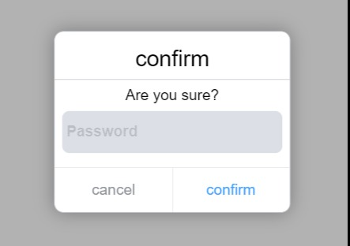

# vue-confirm-mobile

> A confirm component based on [Vue](https://vuejs.org/)2 in mobile.  



## Install

```bash
$ npm i vue-confirm-mobile --save	
```

## Usage

This module provides two ways to use components. First, in main.js Import components in:		

+ Mount as component:	

```js
// main.js
import Vue from "vue";
import App from "./App.vue";
import { VConfirm } from "vue-confirm-mobile";
// import style
import "vue-confirm-mobile/lib/vue-confirm-mobile.css"
Vue.config.productionTip = false;
Vue.component(VConfirm.name, VConfirm);
// Then use it in any. Vue file
<template>
    <v-confirm
        :visible.sync="visible"
        round
        shadow
        @cancel="cancel"
        @open="open"
        @close="close"
        @confirm="confirm"
        titleClassName="title"
        // use prop to define content
        title="title"
        content="content"
        >
        <!--or use slot to define content
        <template slot="head">I'm title</template>
        <template slot="body">I'm content</template>-->
    </v-confirm>
</template>
<script>
    export default {
	   data(){
           return {
               visible:true
           }
       },
       methods:{
           cancel(){},
           close(){},
           open(){},
           confirm(){}
       }
	}
</script>
```

+ Using components as methods

  ```js
  // main.js
  import Vue from "vue";
  import App from "./App.vue";
  import VConfirm from "vue-confirm-mobile";
  // import style
  import "vue-confirm-mobile/lib/vue-confirm-mobile.css"
  Vue.config.productionTip = false;
  Vue.use(VConfirm);
  // Then use it in any. Vue file
  export default {
      //...
      methods:{
          openConfirm(){
              this.$confirm({
                  title:'title',
                  content:'content'
              })
          }
      }
  }
  ```

  ​		

## Options

  + When used as a component: 		

     **basic property**:
   
     | name               | type    | default         | description                                                  |
     | ------------------ | ------- | --------------- | ------------------------------------------------------------ |
     | visible            | Boolean | false           | Whether the component is visible or not. `.Sync `modifier is required to synchronize the status. |
     | title              | String  | 'confirm'       | Component title                                              |
     | content            | String  | 'Are you sure?' | Component body content                                       |
     | cancelText         | String  | 'cancel'        | Text displayed on Cancel button                              |
     | confirmText        | String  | 'confirm'       | Text displayed on Confirm button                             |
     | mask               | Boolean | true            | Whether there is a mask                                      |
     | titleClassName     | String  | ---             | ---                                                          |
     | contentClassName   | String  | ---             | ---                                                          |
     | footerClassName    | String  | ---             | ---                                                          |
     | round              | Boolean | false           | Whether there is fillet effect                               |
     | shadow             | Boolean | false           | Whether there is shadow                                      |
   | password           | Boolean | false           | Whether there is a password input                            |
     | passwordRequired   | Boolean | true            | Whether password is required or not                          |
   | passwordPlacehoder | String  | 'Password'      | password placeholder                                         |
  
  ​		**events**:
  
  | eventName | description                                                  |
  | --------- | ------------------------------------------------------------ |
  | open      | Triggered when displayed                                     |
| close     | Trigger when it disappears                                   |
  | cancel    | Triggered when the cancel button is clicked                  |
| confirm   | Triggered when the confirm button is clicked,if password set to true,will receive password value as parameter. |
  
  ​	  **slots**:
  
  | slotName | description           |
| -------- | --------------------- |
  | head     | Custom header content |
| body     | Custom body content   |
  

  
  + When used as a function: 
  
```js
  this.$confirm(options)
```
  
  `options`:	
  
  ```js
  {
      title,
      content,
      cancelText,
      confirmText,
      titleClassName,
      contentClassName,
      footerClassName,
      mask,
      round,
      shadow,
      password,
    passwordRequired,
      passwordPlaceholder,
    onConfirm,
      onCancel
}
  ```

## License

  MIT
  
  
  
  
  
  